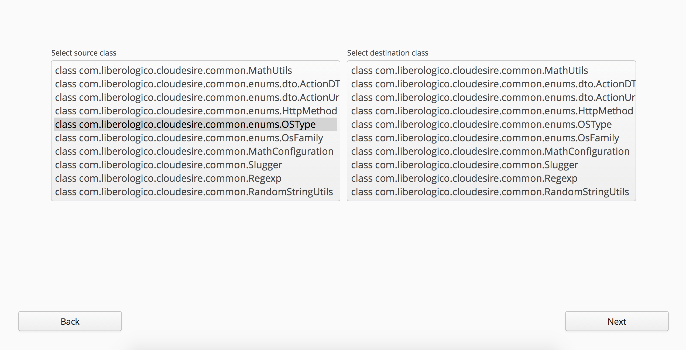
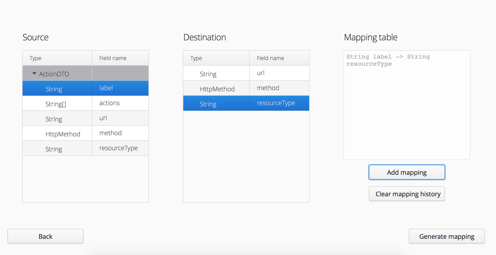
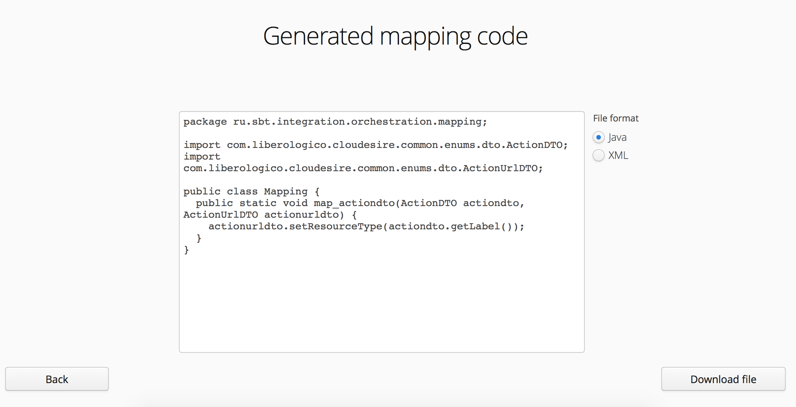

# mapper
Simple mapping app.
It helps you to transform your dto from one to another.

Mapper is based on recursive traversal of a class tree through reflection.
Mapper has UI written with help of Vaadin and based on jetty servlet framework.

To launch the application just add Maven goal:
package jetty:run -Djetty.http.port=8080

To stop the application add Maven goal:
package jetty:stop

